# NayeeUmeed - Comprehensive System Documentation

## Table of Contents
1. [Introduction](#1-introduction)
2. [Objectives](#2-objectives)
3. [Tools/Environment Used](#3-toolsenvironment-used)
4. [Analysis Document](#4-analysis-document)
   - [Software Requirements Specification (SRS)](#41-software-requirements-specification-srs)
   - [Entity-Relationship Diagram](#42-entity-relationship-diagram)
   - [Class Diagram](#43-class-diagram)
   - [Data Flow Diagrams](#44-data-flow-diagrams)
   - [Use Case Diagram](#45-use-case-diagram)
   - [Data Dictionary](#46-data-dictionary)
5. [Design Document](#5-design-document)
   - [Modularization Details](#51-modularization-details)
   - [Component Diagram](#52-component-diagram)
   - [Sequence Diagrams](#53-sequence-diagrams)
   - [Activity Diagrams](#54-activity-diagrams)
   - [Workflow Diagram](#55-workflow-diagram)
   - [Data Integrity & Constraints](#56-data-integrity--constraints)
   - [Procedural Design](#57-procedural-design)
   - [User Interface Design](#58-user-interface-design)
6. [Program Code](#6-program-code)
7. [Testing](#7-testing)
8. [Deployment Diagram](#8-deployment-diagram)
9. [Security Implementation](#9-security-implementation)
10. [Limitations of the Project](#10-limitations-of-the-project)
11. [Conclusion](#11-conclusion)
12. [Comprehensive Testing Strategy](#12-comprehensive-testing-strategy)
13. [Test Artifacts and Documentation](#13-test-artifacts-and-documentation)

## 1. Introduction

NayeeUmeed ("New Hope" in Hindi) is a comprehensive NGO management platform designed to empower communities and transform lives through better organization, resource management, and volunteer coordination. The platform serves as a centralized digital environment connecting four key stakeholder groups in the NGO ecosystem:

1. **Administrators**: Responsible for overall system governance, user management, and organizational oversight
2. **Staff Members**: NGO employees who coordinate resources, manage volunteers, and serve beneficiaries
3. **Volunteers**: Individuals who contribute their time and skills to support the NGO's mission
4. **Beneficiaries**: People who receive services, resources, and support from the NGO

The platform aims to digitize and streamline NGO operations by providing role-specific functionalities, enhancing communication between stakeholders, and optimizing resource allocation. Built with modern web technologies, NayeeUmeed offers a responsive, secure, and user-friendly interface that works across various devices.

The name "NayeeUmeed" reflects the project's mission to bring new hope to communities in need by making NGO operations more efficient and effective, ultimately increasing the impact of the organization's services and resource distribution.

## 2. Objectives

The NayeeUmeed platform has been developed with the following comprehensive objectives:

1. **Improve NGO Operational Efficiency**
   - Streamline administrative workflows and reduce manual paperwork
   - Centralize information and eliminate data silos
   - Automate routine tasks to free up staff time for more valuable activities
   - Provide real-time visibility into organizational operations

2. **Enhance Volunteer Management**
   - Create a structured system for volunteer recruitment and onboarding
   - Enable efficient scheduling and assignment of volunteers
   - Track volunteer contributions, hours, and impact
   - Provide recognition and achievement tracking for volunteer retention
   - Deliver training resources to improve volunteer effectiveness

3. **Optimize Resource Distribution**
   - Maintain accurate inventory of available resources
   - Track resource allocation and distribution to beneficiaries
   - Prevent wastage through better forecasting and planning
   - Ensure equitable distribution based on need and priority
   - Generate reports on resource utilization for donor accountability

4. **Facilitate Beneficiary Support**
   - Create digital profiles of beneficiaries and their needs
   - Enable self-service request submission for services
   - Provide appointment scheduling with staff members
   - Track service delivery and outcomes
   - Maintain history of assistance for continuity of care

5. **Enable Data-Driven Decision Making**
   - Collect comprehensive operational data across all NGO activities
   - Generate insights through analytics and reporting tools
   - Track key performance indicators for different departments
   - Support strategic planning with historical data and trends
   - Provide evidence for grant applications and donor reporting

6. **Improve Stakeholder Communication**
   - Enable broadcast announcements to specific user groups
   - Facilitate coordination between staff and volunteers
   - Provide status updates on service requests to beneficiaries
   - Create transparency in resource allocation and service delivery
   - Bridge communication gaps between field and administrative staff

7. **Ensure Security and Access Control**
   - Implement role-based access to protect sensitive information
   - Maintain data privacy in accordance with best practices
   - Create audit trails for critical operations
   - Ensure proper authentication and authorization
   - Protect beneficiary information from unauthorized access

8. **Scale NGO Impact**
   - Support organizational growth through scalable architecture
   - Enable serving more beneficiaries without proportional staff increases
   - Improve coordination across multiple locations or projects
   - Facilitate knowledge transfer and standardization of processes
   - Reduce overhead costs through digital transformation

## 3. Tools/Environment Used

### Frontend Technologies
- **React**: JavaScript library for building the user interface with component-based architecture
- **TypeScript**: Superset of JavaScript that adds static typing for improved code quality and developer experience
- **Tailwind CSS**: Utility-first CSS framework for rapid UI development with consistent design
- **Shadcn UI**: Component library built on top of Tailwind CSS providing accessible, customizable components
- **Lucide React**: Icon library providing over 1000 consistent, customizable icons
- **React Router DOM**: Library for declarative routing in React applications
- **Tanstack React Query**: Data fetching, caching, and state management library
- **React Hook Form**: Performant and flexible library for form validation and handling
- **Zod**: TypeScript-first schema validation library
- **Recharts**: Composable charting library built on React components for data visualization
- **React Day Picker**: Flexible date picker component for calendar implementations
- **Next Themes**: Theme management solution for implementing light/dark mode

### Backend Technologies
- **Supabase**: Backend-as-a-Service platform providing:
  - **PostgreSQL Database**: Relational database with advanced features
  - **Authentication**: User authentication with multiple providers
  - **Authorization**: Row-level security for data access control
  - **Storage**: File storage with access controls
  - **Edge Functions**: Serverless functions for custom backend logic
  - **Realtime**: WebSocket-based real-time data subscriptions

### Development Tools
- **Vite**: Next-generation frontend tooling for faster development and optimized production builds
- **ESLint**: Static code analysis tool for identifying problematic patterns in JavaScript/TypeScript
- **TypeScript**: For type checking and improved developer experience
- **Git**: Version control system for tracking changes and collaborative development
- **npm/Bun**: Package managers for JavaScript dependencies

### Development Environment
- **VS Code**: Code editor with TypeScript integration and extensions
- **Chrome DevTools**: Browser-based debugging tools
- **Supabase CLI**: Command-line interface for Supabase development
- **Postman/Insomnia**: API testing tools

### Deployment and Infrastructure
- **Supabase Cloud**: For database, authentication, and serverless functions
- **Lovable**: Web application deployment and hosting platform
- **GitHub Actions**: CI/CD pipeline for automated testing and deployment
- **Custom Domain Provider**: For production domain hosting

## 4. Analysis Document

### 4.1 Software Requirements Specification (SRS)

#### 4.1.1 Functional Requirements

##### User Management and Authentication
- **FR-UM-01**: The system shall support user registration with email and password
- **FR-UM-02**: The system shall implement role-based access control with four user roles: Admin, Staff, Volunteer, and Beneficiary
- **FR-UM-03**: The system shall allow administrators to create, view, update, and deactivate user accounts
- **FR-UM-04**: The system shall allow users to update their profile information
- **FR-UM-05**: The system shall support secure authentication with token-based sessions
- **FR-UM-06**: The system shall enforce password security requirements
- **FR-UM-07**: The system shall provide password reset functionality

##### Admin Functionality
- **FR-AD-01**: The system shall provide an admin dashboard with organizational metrics
- **FR-AD-02**: The system shall allow admins to manage all user accounts
- **FR-AD-03**: The system shall enable admins to create system-wide announcements
- **FR-AD-04**: The system shall provide analytics and reporting capabilities
- **FR-AD-05**: The system shall maintain audit logs for critical operations
- **FR-AD-06**: The system shall allow configuration of system settings
- **FR-AD-07**: The system shall allow admins to view resource allocation statistics

##### Staff Functionality
- **FR-ST-01**: The system shall provide a staff dashboard with relevant metrics
- **FR-ST-02**: The system shall support volunteer management (scheduling, evaluation)
- **FR-ST-03**: The system shall enable beneficiary management and needs assessment
- **FR-ST-04**: The system shall provide resource inventory and allocation tools
- **FR-ST-05**: The system shall facilitate task management and assignments
- **FR-ST-06**: The system shall support appointment scheduling with beneficiaries
- **FR-ST-07**: The system shall enable processing of service requests
- **FR-ST-08**: The system shall allow staff to respond to urgent requests
- **FR-ST-09**: The system shall support report generation
- **FR-ST-10**: The system shall track resource distribution to beneficiaries

##### Volunteer Functionality
- **FR-VO-01**: The system shall display a volunteer dashboard with relevant information
- **FR-VO-02**: The system shall show the volunteer's schedule and upcoming shifts
- **FR-VO-03**: The system shall list available volunteer opportunities
- **FR-VO-04**: The system shall allow volunteers to register for opportunities
- **FR-VO-05**: The system shall track volunteer hours and contributions
- **FR-VO-06**: The system shall display volunteer achievements
- **FR-VO-07**: The system shall provide access to training resources
- **FR-VO-08**: The system shall show assigned beneficiaries and tasks
- **FR-VO-09**: The system shall allow volunteers to log their activity
- **FR-VO-10**: The system shall allow volunteers to view announcements

##### Beneficiary Functionality
- **FR-BE-01**: The system shall display a beneficiary dashboard with relevant information
- **FR-BE-02**: The system shall allow beneficiaries to submit service requests
- **FR-BE-03**: The system shall enable appointment scheduling with staff
- **FR-BE-04**: The system shall provide access to available resources
- **FR-BE-05**: The system shall track service request status
- **FR-BE-06**: The system shall maintain history of services received
- **FR-BE-07**: The system shall allow beneficiaries to view announcements
- **FR-BE-08**: The system shall enable beneficiaries to update their needs profile
- **FR-BE-09**: The system shall display upcoming appointments

##### Resource Management
- **FR-RM-01**: The system shall maintain an inventory of resources
- **FR-RM-02**: The system shall track resource quantities and availability
- **FR-RM-03**: The system shall record resource allocations to beneficiaries
- **FR-RM-04**: The system shall generate reports on resource utilization
- **FR-RM-05**: The system shall alert when resources are running low
- **FR-RM-06**: The system shall categorize resources by type
- **FR-RM-07**: The system shall track resource sources/donors

##### Announcement System
- **FR-AN-01**: The system shall allow creation of announcements
- **FR-AN-02**: The system shall display announcements to relevant user groups
- **FR-AN-03**: The system shall maintain history of past announcements
- **FR-AN-04**: The system shall allow filtering announcements by date and status

##### Reporting System
- **FR-RE-01**: The system shall generate operational reports
- **FR-RE-02**: The system shall provide customizable report parameters
- **FR-RE-03**: The system shall display visual data representations
- **FR-RE-04**: The system shall allow export of reports in common formats
- **FR-RE-05**: The system shall save report templates for reuse

#### 4.1.2 Non-Functional Requirements

##### Performance
- **NFR-PE-01**: The system shall load pages within 3 seconds under normal network conditions
- **NFR-PE-02**: The system shall support at least 100 concurrent users
- **NFR-PE-03**: Database queries shall complete within 1 second
- **NFR-PE-04**: The system shall be responsive across different device types and screen sizes
- **NFR-PE-05**: API endpoints shall respond within 2 seconds

##### Security
- **NFR-SE-01**: The system shall encrypt all passwords using industry-standard algorithms
- **NFR-SE-02**: The system shall implement JWT-based authentication
- **NFR-SE-03**: The system shall enforce role-based access control for all operations
- **NFR-SE-04**: The system shall implement row-level security in the database
- **NFR-SE-05**: All communication shall be over HTTPS
- **NFR-SE-06**: The system shall log security-related events
- **NFR-SE-07**: The system shall implement input validation for all user inputs

##### Usability
- **NFR-US-01**: The system shall use consistent navigation and interface elements
- **NFR-US-02**: The system shall provide clear error messages and validation feedback
- **NFR-US-03**: The system shall be accessible according to WCAG 2.1 Level AA standards
- **NFR-US-04**: The system shall support mobile and desktop viewing
- **NFR-US-05**: The system shall provide help documentation for key features
- **NFR-US-06**: The system shall use intuitive icons and labels

##### Reliability
- **NFR-RE-01**: The system shall have 99.5% uptime
- **NFR-RE-02**: The system shall implement data backup procedures
- **NFR-RE-03**: The system shall handle errors gracefully with appropriate user feedback
- **NFR-RE-04**: The system shall maintain data integrity through proper validation
- **NFR-RE-05**: The system shall implement proper exception handling

##### Maintainability
- **NFR-MA-01**: The system shall follow a modular architecture
- **NFR-MA-02**: The system code shall follow consistent coding standards
- **NFR-MA-03**: The system shall include comprehensive documentation
- **NFR-MA-04**: The system shall use meaningful variable and function names
- **NFR-MA-05**: The system shall separate concerns between UI, business logic, and data access

##### Scalability
- **NFR-SC-01**: The system architecture shall support horizontal scaling
- **NFR-SC-02**: The system shall implement efficient database indexing
- **NFR-SC-03**: The system shall support increased data volume without significant performance degradation
- **NFR-SC-04**: The system shall implement caching strategies for frequently accessed data

### 4.2 Entity-Relationship Diagram

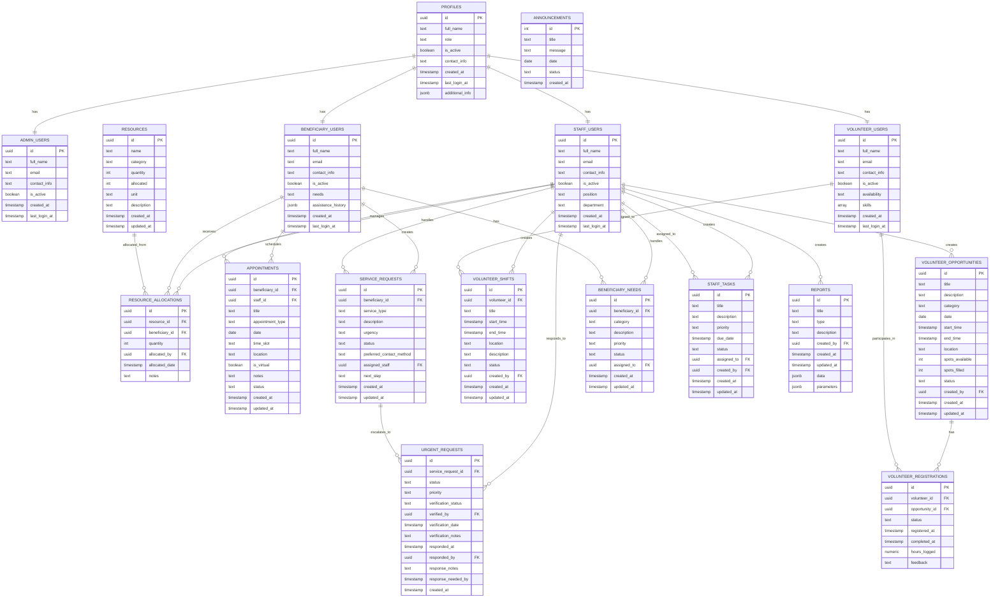

### 4.3 Class Diagram

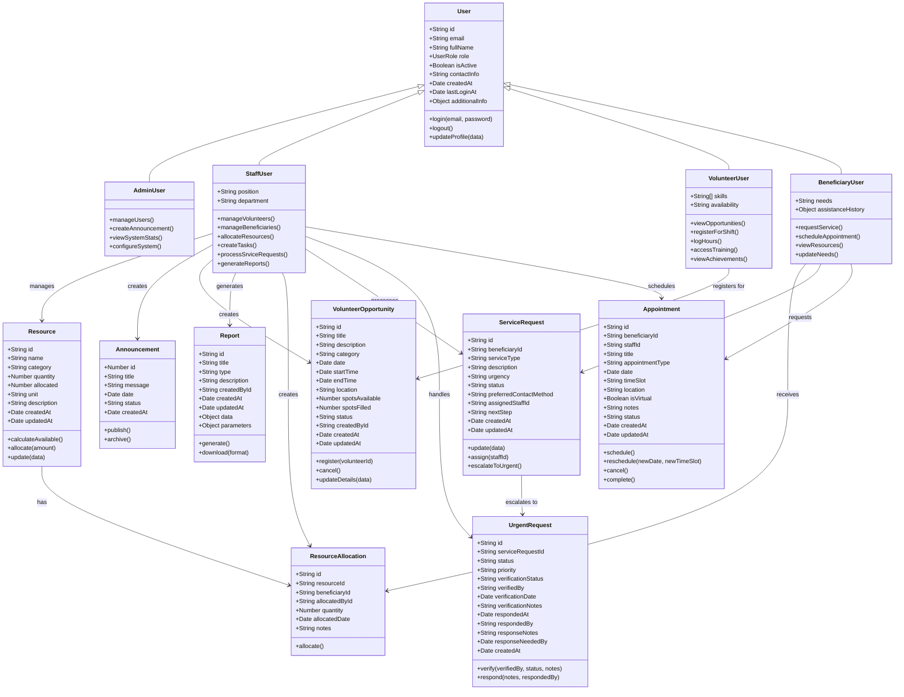

### 4.4 Data Flow Diagrams

#### Level 0 DFD (Context Diagram)

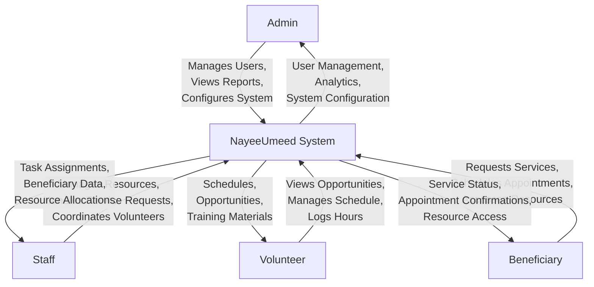

#### Level 1 DFD

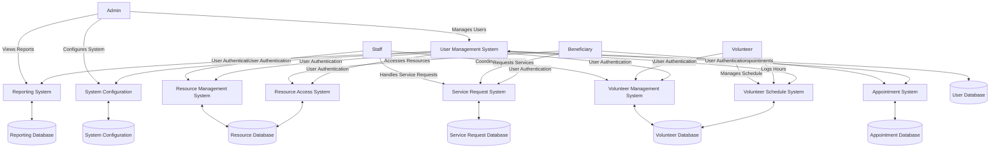

### 4.5 Use Case Diagram

```mermaid
graph TD
    subgraph "NayeeUmeed System"
        UC1[Manage Users]
        UC2[Create Announcements]
        UC3[View System Reports]
        UC4[Configure System]
        UC5[Manage Resources]
        UC6[Process Service Requests]
        UC7[Manage Volunteers]
        UC8[Generate Reports]
        UC9[Allocate Resources]
        UC10[Manage Appointments]
        UC11[View Opportunities]
        UC12[Register for Shifts]
        UC13[Log Volunteer Hours]
        UC14[Access Training]
        UC15[Request Services]
        UC16[Schedule Appointments]
        UC17[View Resource Catalog]
        UC18[Track Request Status]
        UC19[Handle Urgent Requests]
        UC20[Create Tasks]
    end
    
    Admin --> UC1
    Admin --> UC2
    Admin --> UC3
    Admin --> UC4
    Admin --> UC5
    
    Staff --> UC2
    Staff --> UC5
    Staff --> UC6
    Staff --> UC7
    Staff --> UC8
    Staff --> UC9
    Staff --> UC10
    Staff --> UC19
    Staff --> UC20
    
    Volunteer --> UC11
    Volunteer --> UC12
    Volunteer --> UC13
    Volunteer --> UC14
    
    Beneficiary --> UC15
    Beneficiary --> UC16
    Beneficiary --> UC17
    Beneficiary --> UC18
```

### 4.6 Data Dictionary

#### User Management Tables

| Table Name | Field Name | Data Type | Constraints | Description |
|------------|------------|-----------|-------------|-------------|
| profiles | id | uuid | PK, NOT NULL | Unique identifier for the profile |
| profiles | full_name | text | NOT NULL | Full name of the user |
| profiles | role | text | NOT NULL | User role: admin, staff, volunteer, or beneficiary |
| profiles | is_active | boolean | NOT NULL, DEFAULT true | Whether the user account is active |
| profiles | contact_info | text | NULL | User contact information |
| profiles | created_at | timestamp | NOT NULL, DEFAULT now() | When the profile was created |
| profiles | last_login_at | timestamp | NULL | When the user last logged in |
| profiles | additional_info | jsonb | NULL | Additional user information as JSON |

#### Resource Management Tables

| Table Name | Field Name | Data Type | Constraints | Description |
|------------|------------|-----------|-------------|-------------|
| resources | id | uuid | PK, NOT NULL, DEFAULT gen_random_uuid() | Unique identifier for the resource |
| resources | name | text | NOT NULL | Name of the resource |
| resources | category | text | NOT NULL | Category of the resource |
| resources | quantity | integer | NOT NULL, DEFAULT 0 | Total quantity available |
| resources | allocated | integer | NOT NULL, DEFAULT 0 | Quantity already allocated |
| resources | unit | text | NOT NULL | Unit of measurement |
| resources | description | text | NULL | Description of the resource |
| resources | created_at | timestamp | NOT NULL, DEFAULT now() | When the resource was created |
| resources | updated_at | timestamp | NOT NULL, DEFAULT now() | When the resource was last updated |

#### Resource Allocation Table

| Table Name | Field Name | Data Type | Constraints | Description |
|------------|------------|-----------|-------------|-------------|
| resource_allocations | id | uuid | PK, NOT NULL, DEFAULT gen_random_uuid() | Unique identifier for the allocation |
| resource_allocations | resource_id | uuid | NOT NULL, FK | Reference to the resource |
| resource_allocations | beneficiary_id | uuid | NOT NULL, FK | Reference to the beneficiary |
| resource_allocations | quantity | integer | NOT NULL | Quantity allocated |
| resource_allocations | allocated_by | uuid | NOT NULL, FK | Staff who made the allocation |
| resource_allocations | allocated_date | timestamp | NOT NULL, DEFAULT now() | When the allocation was made |
| resource_allocations | notes | text | NULL | Notes about the allocation |

#### Service Request Tables

| Table Name | Field Name | Data Type | Constraints | Description |
|------------|------------|-----------|-------------|-------------|
| service_requests | id | uuid | PK, NOT NULL, DEFAULT gen_random_uuid() | Unique identifier for the service request |
| service_requests | beneficiary_id | uuid | NOT NULL, FK | Reference to the beneficiary |
| service_requests | service_type | text | NOT NULL | Type of service requested |
| service_requests | description | text | NULL | Description of the request |
| service_requests | urgency | text | NOT NULL | Urgency level: high, medium, low |
| service_requests | status | text | NOT NULL, DEFAULT 'pending' | Status of the request |
| service_requests | preferred_contact_method | text | NULL | Preferred method of contact |
| service_requests | assigned_staff | uuid | NULL, FK | Staff member assigned to the request |
| service_requests | next_step | text | NULL | Next steps for handling the request |
| service_requests | created_at | timestamp | NOT NULL, DEFAULT now() | When the request was created |
| service_requests | updated_at | timestamp | NOT NULL, DEFAULT now() | When the request was last updated |

## 5. Design Document

### 5.1 Modularization Details

The NayeeUmeed platform follows a modular architecture organized around functionality and user roles:

#### Component Structure
- **Layout Components**: Shared UI elements like navigation, sidebars, and common layouts
- **UI Components**: Reusable UI elements like buttons, forms, cards, and modals
- **Page Components**: Complete pages for different sections of the application
- **Role-Specific Components**: Components tailored to each user role

#### Service Layer
- **Authentication Services**: Managing user authentication and session
- **Resource Management Services**: Handling resources and allocations
- **Volunteer Management Services**: Managing volunteers and opportunities
- **Beneficiary Management Services**: Handling beneficiary needs and requests
- **Appointment Services**: Managing scheduling and appointments
- **Service Request Services**: Processing service and urgent requests
- **Reporting Services**: Generating and displaying reports

#### State Management
- React Query for server state management
- React Context for application-wide state (authentication, theme)
- Local component state for UI-specific state

### 5.2 Component Diagram

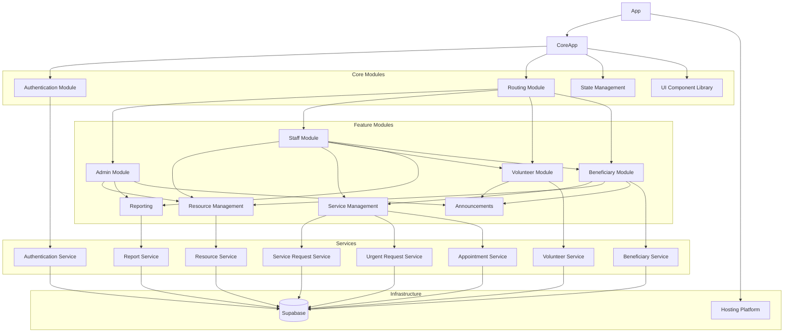

### 5.3 Sequence Diagrams

#### Authentication Sequence

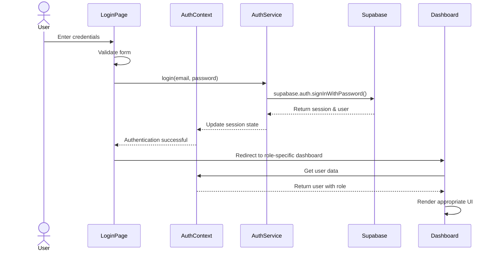

#### Service Request Sequence

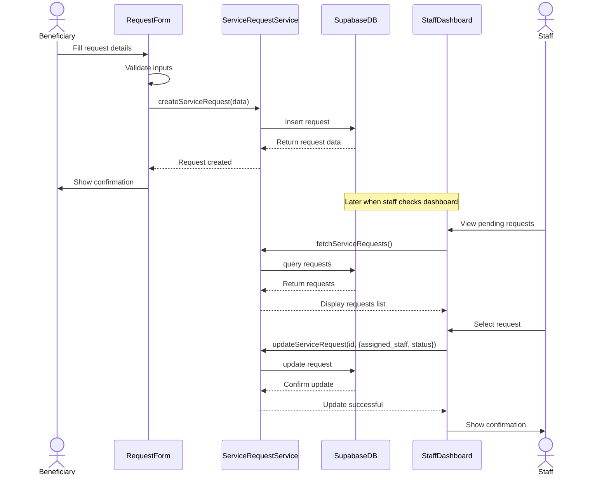

#### Resource Allocation Sequence

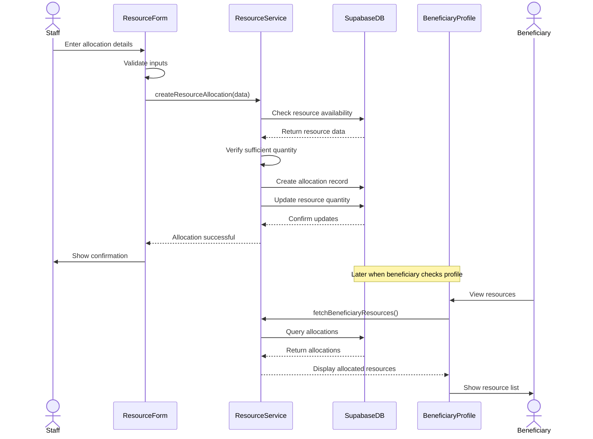

### 5.4 Activity Diagrams

#### Service Request Processing

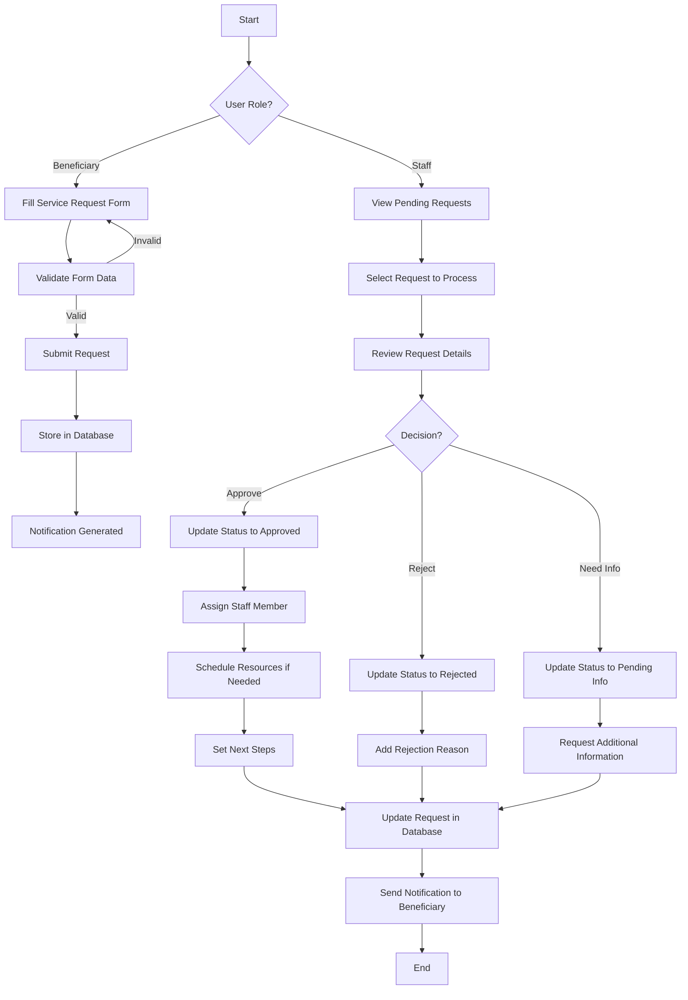

#### Volunteer Opportunity Registration

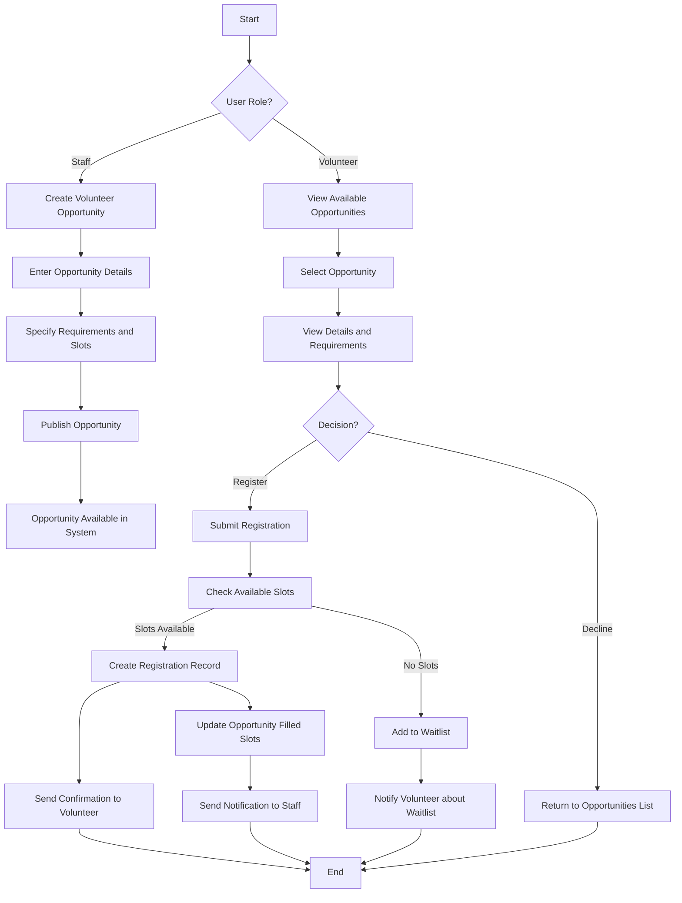

### 5.5 Workflow Diagram

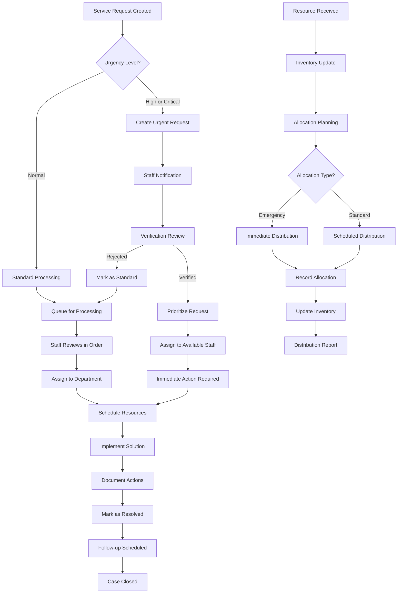

### 5.6 Data Integrity & Constraints

#### Database Design
- PostgreSQL database hosted on Supabase
- Tables structured around entity types (users, resources, requests, etc.)
- Foreign key constraints to maintain referential integrity
- Timestamp fields for auditing and tracking changes
- Row-Level Security policies to control access

#### Data Validation
- Client-side validation using Zod schemas
- Server-side validation through database constraints
- Type checking using TypeScript

#### Constraints Implementation
- **NOT NULL** constraints for required fields
- **FOREIGN KEY** constraints to enforce relationships
- **DEFAULT** values for standardization
- **CHECK** constraints for field value validation
- **UNIQUE** constraints to prevent duplicates

#### Data Integrity Measures
- Transaction-based operations for multi-table updates
- Optimistic concurrency control
- Data validation at every layer (UI, service, database)
- Consistent error handling and reporting

### 5.7 Procedural Design

#### Authentication Flow
1. User enters credentials on login page
2. Client-side validation ensures data format is correct
3. Credentials are sent to Supabase Auth API
4. Upon successful authentication, JWT token is stored
5. User profile is fetched based on authenticated user ID
6. Role-specific authorization is applied
7. User is redirected to role-specific dashboard
8. Session state is maintained and refreshed as needed

#### Service Request Flow
1. Beneficiary creates service request with details
2. Request validation ensures all required fields are present
3. Request is stored in the database with "pending" status
4. Staff is notified of new requests
5. Staff reviews and assigns the request
6. Status updates are recorded as request progresses
7. Beneficiary can track status through their dashboard
8. Upon completion, service history is updated

#### Resource Allocation Flow
1. Staff identifies resources needed for beneficiaries
2. Available resources are checked in the inventory
3. Allocation is created linking resources to beneficiaries
4. Resource quantities are updated accordingly
5. Beneficiary is notified of resource allocation
6. Allocation history is maintained for reporting

### 5.8 User Interface Design

#### Design System
- Consistent color scheme based on primary, secondary, and accent colors
- Typography hierarchy with distinct heading and body text styles
- Component library (Shadcn UI) for consistent UI elements
- Responsive design patterns for mobile, tablet, and desktop

#### Layout Structure
- Site-wide navigation with role-based access
- Dashboard layouts with overview cards and key metrics
- List views with filtering and sorting capabilities
- Detail views for records with actions
- Form interfaces for data entry with validation

#### Key UI Elements
- Role-based dashboards with relevant metrics
- Calendar interfaces for scheduling
- Resource management interfaces with allocation tools
- Service request forms with status tracking
- Report generation interfaces with filters

#### Design Principles
- Accessibility: WCAG 2.1 Level AA compliance
- Consistency: Uniform patterns and components
- Simplicity: Clear, uncluttered interfaces
- Responsiveness: Proper display across devices
- Feedback: Clear indication of system status
- Error handling: Helpful error messages

## 6. Program Code

The codebase is organized into several key areas:

### Frontend Structure
- `/src/pages`: Page components organized by user role
- `/src/components`: Reusable UI components and role-specific components
- `/src/services`: Service functions for API interactions
- `/src/contexts`: React context providers for state management
- `/src/hooks`: Custom React hooks for shared logic
- `/src/types`: TypeScript type definitions
- `/src/utils`: Utility functions and helpers
- `/src/lib`: Shared libraries and configurations
- `/src/integrations`: Integration code for external services

### Backend Structure
- Supabase tables and relationships
- Row-Level Security policies
- Edge Functions for custom serverless logic
- Database triggers for automation

### Key Components

#### Authentication System
```typescript
// src/contexts/AuthContext.tsx - Authentication context provider
import React, { createContext, useState, useEffect, useContext } from "react";
import { supabase } from "@/integrations/supabase/client";
import { User } from "@/types/auth";
import { toast } from "@/components/ui/use-toast";

// Authentication context providing user state and methods for login/logout
export const AuthContext = createContext<AuthContextType>({
  user: null,
  isAuthenticated: false,
  isLoading: true,
  login: async () => {},
  logout: async () => {},
  createUser: async () => {},
  updateUserProfile: async () => {},
  getAllUsers: async () => [],
  getUserById: async () => undefined,
});
```

#### Dashboard Components
```typescript
// src/pages/admin/Index.tsx - Admin dashboard component
import React, { useState } from "react";
import { useQuery } from "@tanstack/react-query";
import SharedDashboardLayout from "@/components/layout/SharedDashboardLayout";
import { Card, CardContent, CardHeader, CardTitle } from "@/components/ui/card";
import { fetchAllUsers, fetchSystemStats } from "@/services/adminService";

// Admin dashboard with statistics, activity, and user management
const AdminDashboard = () => {
  // Dashboard implementation with metrics and charts
};
```

#### Service Management
```typescript
// src/services/serviceRequestService.ts - Service request handling
import { supabase } from "@/integrations/supabase/client";
import { toast } from "@/components/ui/use-toast";
import { ServiceRequest } from "@/types/staff";

// Functions for fetching, creating, and updating service requests
export async function fetchServiceRequests(): Promise<ServiceRequest[]> {
  // Implementation for fetching service requests from the database
}

export async function updateServiceRequest(id: string, request: Partial<ServiceRequest>): Promise<ServiceRequest | null> {
  // Implementation for updating service requests
}
```

## 7. Testing

### Unit Testing

#### Test Case Design
- Component rendering tests to verify UI elements
- Service function tests with mocked API responses
- Utility function tests for data transformation and validation
- Form validation tests using schema validators

#### Unit Test Coverage
- Authentication functions
- Form validation
- Service functions
- Utility functions
- Component rendering

#### Unit Test Implementation
```typescript
// Example test for a service function
import { fetchResources } from '@/services/resourceManagementService';
import { supabase } from '@/integrations/supabase/client';

jest.mock('@/integrations/supabase/client');

describe('Resource Management Service', () => {
  beforeEach(() => {
    jest.clearAllMocks();
  });

  test('fetchResources should return resources when successful', async () => {
    const mockResources = [{ id: 'abc', name: 'Test Resource' }];
    supabase.from.mockReturnValue({
      select: jest.fn().mockReturnValue({
        order: jest.fn().mockResolvedValue({ data: mockResources, error: null })
      })
    });

    const result = await fetchResources();
    expect(result).toEqual(mockResources);
    expect(supabase.from).toHaveBeenCalledWith('resources');
  });
});
```

### Integration Testing

#### Integration Test Design
- Authentication flow testing
- Form submission and API interaction testing
- Multi-step workflow testing
- Cross-component communication testing

#### Integration Test Coverage
- Complete user flows (e.g., service request from creation to completion)
- Data flow between components
- State management across component boundaries
- Error handling and recovery paths

#### Integration Test Implementation
```typescript
// Example integration test for service request workflow
describe('Service Request Workflow', () => {
  beforeEach(() => {
    // Setup authentication and test data
  });

  test('Create and process service request', async () => {
    // 1. Create service request as beneficiary
    // 2. Verify creation in database
    // 3. Login as staff member
    // 4. View and update service request
    // 5. Verify status changes
    // 6. Login as beneficiary again
    // 7. Verify visibility of status updates
  });
});
```

### System Testing

#### System Test Design
- End-to-end user flows for each role
- Cross-device compatibility testing
- Performance and load testing
- Security testing for authentication and authorization

#### System Test Coverage
- Complete business processes
- UI functionality across different browsers and devices
- Performance under various loads
- Security controls and access restrictions

#### System Test Implementation
- Manual testing of complete user flows
- Testing on different devices and screen sizes
- Automated end-to-end tests for critical paths
- Security auditing of authentication and access controls

### Test Results and Bug Fixes

#### Common Issues Resolved
- Authentication token refresh issues
- Data fetching race conditions
- Form validation edge cases
- Responsive design breakpoints
- Performance bottlenecks in data heavy components

#### Performance Improvements
- Query caching implementation
- Component rendering optimization
- Database query optimization
- Lazy loading for heavy components

## 8. Deployment Diagram

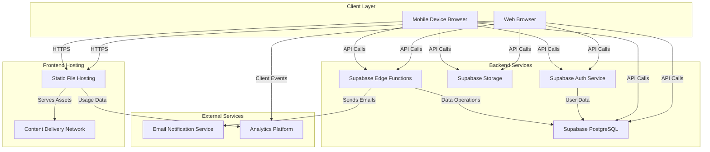

## 9. Security Implementation

### Authentication Security
- JWT-based authentication through Supabase Auth
- Secure password hashing and storage (Argon2 via Supabase)
- Token refresh mechanism for session maintenance
- Automatic session timeout for inactive users
- Email verification for new accounts

### Authorization and Access Control
- Role-based access control for routes and components
- Row-Level Security policies in the database
- Frontend route guards to prevent unauthorized access
- Component-level access control based on user roles
- Permission-based UI rendering

### Data Security
- Input validation on all user-provided data
- Parameter sanitization for database queries
- HTTPS for all data transmission
- Secure storage of sensitive information
- Data minimization principle applied

### API Security
- JWT verification for API access
- Rate limiting to prevent abuse
- Proper error handling to avoid information leakage
- Function-level permissions for Supabase Edge Functions
- Protection against common web vulnerabilities (CSRF, XSS)

### Security Implementation Examples

#### Route Guard Component
```typescript
// Route guard for protected routes
const RouteGuard = ({ children, requiredRoles = [] }) => {
  const { isAuthenticated, user, isLoading } = useAuth();
  const location = useLocation();

  if (isLoading) {
    return <LoadingScreen />;
  }

  if (!isAuthenticated) {
    return <Navigate to="/login" state={{ from: location }} replace />;
  }

  if (requiredRoles.length > 0 && !hasRequiredRole(user?.role, requiredRoles)) {
    return <Navigate to="/unauthorized" replace />;
  }

  return <>{children}</>;
};
```

#### Row-Level Security Policy
```sql
-- RLS policy example for service requests
CREATE POLICY "Staff can update service requests"
  ON public.service_requests
  FOR UPDATE
  TO authenticated
  USING (
    (auth.jwt() ->> 'role' = 'staff' OR auth.jwt() ->> 'role' = 'admin')
  );
```

#### Input Validation
```typescript
// Zod schema for service request validation
const serviceRequestSchema = z.object({
  service_type: z.string().min(1, "Service type is required"),
  description: z.string().min(10, "Description must be at least 10 characters"),
  urgency: z.enum(["low", "medium", "high"]),
  preferred_contact_method: z.string().optional(),
});
```

## 10. Limitations of the Project

### Technical Limitations
1. **Offline Functionality**: The application requires an internet connection and does not support offline mode, which can be problematic in areas with limited connectivity.

2. **Mobile Experience**: While responsive, the application is primarily designed for desktop use. A dedicated mobile application would provide a better experience for field workers.

3. **Real-time Updates**: The current implementation has limited real-time functionality, which could be enhanced with more advanced WebSocket implementation.

4. **Scalability Concerns**: As the number of users and data volume grows, additional optimization may be needed for database queries and frontend performance.

5. **File Storage Limitations**: The storage solution has size and type limitations that may affect document management capabilities.

6. **Print Functionality**: Limited support for print-optimized views of reports and data.

### Functional Limitations
1. **Limited Reporting**: The reporting functionality is basic and could be expanded with more sophisticated analytics and data visualization.

2. **Document Management**: The system has limited capabilities for document management and file sharing, which might be essential for certain NGO operations.

3. **Integration Capabilities**: The platform has limited integration with external systems like SMS gateways, payment processors, or other NGO management tools.

4. **Multi-language Support**: The application currently supports only English, which limits usability in regions where other languages are prevalent.

5. **Limited Automation**: Many processes require manual intervention that could potentially be automated.

6. **Calendar Integration**: No integration with external calendar systems (Google Calendar, Outlook).

### Operational Limitations
1. **Complex Setup**: Initial system setup requires technical knowledge, making it challenging for smaller organizations without IT support.

2. **Training Requirements**: The system's comprehensive nature requires substantial training for users to utilize all features effectively.

3. **Customization Constraints**: While the system covers many NGO needs, specific organizational requirements might require custom development.

4. **Resource Requirements**: Smaller NGOs with limited resources might find the system's hosting and maintenance requirements challenging.

5. **Backup and Recovery**: Limited built-in options for backup and disaster recovery.

6. **Dependency on Third-Party Services**: Reliance on external services (Supabase, hosting providers) introduces potential points of failure.

## 11. Conclusion

The NayeeUmeed platform represents a comprehensive solution for NGO operations management, designed to address the diverse needs of administrators, staff, volunteers, and beneficiaries. By digitizing core processes and providing role-specific interfaces, the system enables more efficient service delivery, better resource allocation, and improved coordination among all stakeholders.

The platform's modular architecture and modern technology stack provide a solid foundation for scalability and future enhancements. The use of React, TypeScript, and Supabase ensures a robust, maintainable codebase that can evolve with the organization's needs.

Key strengths of the NayeeUmeed system include:

1. **Comprehensive Role-Based Functionality**: Each user type has access to features tailored to their specific needs and responsibilities.

2. **Resource Optimization**: The platform enables better tracking and allocation of limited resources, ensuring they reach those most in need.

3. **Improved Coordination**: Enhanced communication and task management features facilitate better coordination between staff and volunteers.

4. **Data-Driven Decision Making**: Reporting and analytics capabilities provide insights for strategic planning and operational improvements.

5. **Enhanced Beneficiary Experience**: Digital service requests and appointment scheduling improve accessibility and service delivery.

While the system has limitations, particularly in areas of offline functionality, mobile experience, and advanced integrations, it provides a valuable tool for organizations seeking to digitize their operations and increase their impact.

Future development efforts could focus on addressing these limitations, particularly by enhancing mobile capabilities, adding offline support, expanding reporting functionality, and developing integrations with complementary systems. Additionally, ongoing user feedback and iterative improvement will be essential to ensure the platform continues to meet the evolving needs of NGO stakeholders.

In summary, the NayeeUmeed platform delivers on its mission to bring "new hope" by empowering NGOs with digital tools that streamline operations, optimize resource utilization, and ultimately enhance their ability to serve communities in need.

## 12. Comprehensive Testing Strategy

### 12.1 Test Plan Overview

The comprehensive test plan provides a detailed strategy for validating the functionality, performance, security, and user experience of the NayeeUmeed platform. The test plan is divided into several key categories:

1. Functional Testing
2. UI/UX Testing
3. Performance Testing
4. Security Testing
5. Integration Testing

### 12.2 Detailed Test Matrix

#### Test Type Breakdown

| Test Category | Number of Test Cases | Coverage Areas |
|--------------|----------------------|----------------|
| Functional Testing | 35 | Authentication, User Management, Resource Management, Service Requests |
| UI/UX Testing | 6 | Responsiveness, Accessibility, Usability |
| Performance Testing | 3 | Load Testing, Speed Testing, Resource Usage |
| Security Testing | 4 | Password Security, Authorization, Data Protection |
| Integration Testing | 3 | Service Integration, Database Consistency |

### 12.3 Test Execution Guidelines

1. **Preparation**:
   - Ensure a clean, consistent test environment
   - Prepare test data across all user roles
   - Set up monitoring and logging tools

2. **Execution**:
   - Follow test cases in the order provided
   - Document actual results and compare with expected results
   - Report and track any discrepancies
   - Prioritize high and medium severity test cases

3. **Reporting**:
   - Use the provided test matrix to track test status
   - Provide detailed notes for failed test cases
   - Recommend remediation steps for identified issues

### 12.4 Test Environment Requirements

- **Hardware**:
  - Multiple device types (desktop, tablet, mobile)
  - Varied screen sizes and resolutions
  - Different network conditions

- **Software**:
  - Latest versions of Chrome, Firefox, Safari, Edge
  - Mobile browsers (iOS Safari, Android Chrome)
  - Screen readers for accessibility testing

### 12.5 Continuous Testing Approach

- Integrate automated testing in CI/CD pipeline
- Perform regression testing after each major update
- Conduct periodic comprehensive manual testing
- Maintain and update test cases as system evolves

## 13. Test Artifacts and Documentation

- Detailed test cases (included in this document)
- Test execution reports
- Defect tracking logs
- Performance and security testing reports
